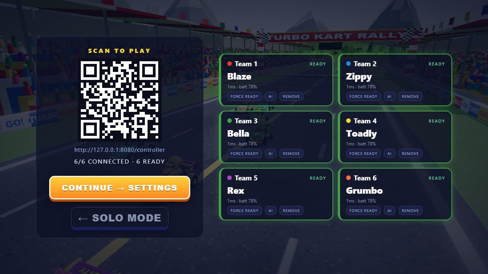
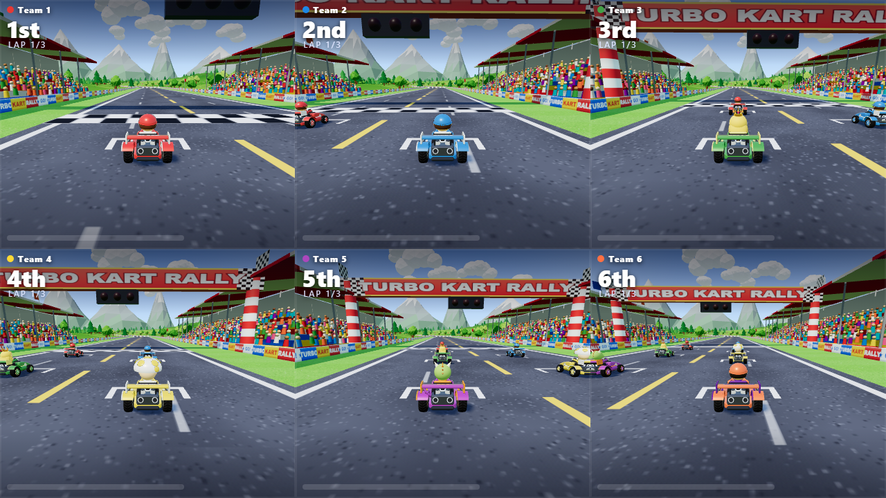
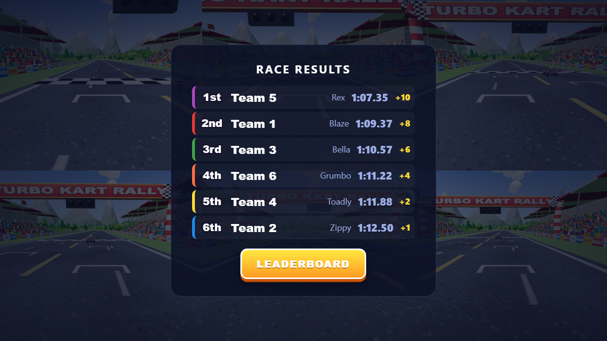
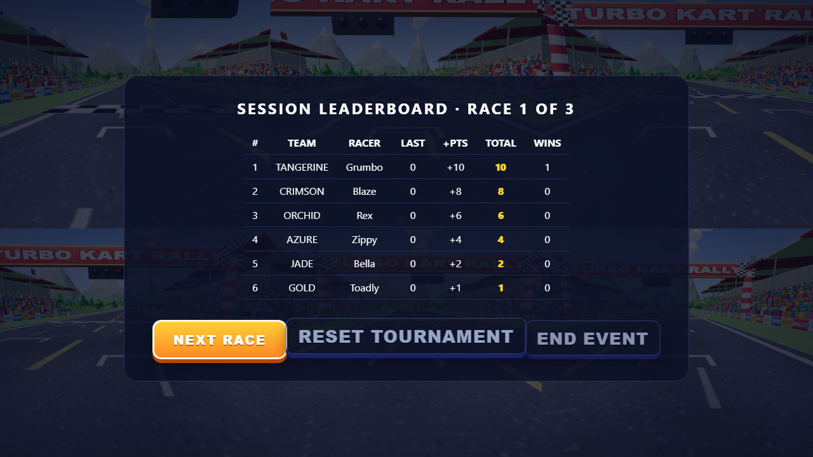

# Turbo Kart Rally

**An arcade kart racer in the spirit of Mario Kart, built entirely with Three.js. Every mesh, texture, sound effect and music track is generated in code at load time. There are no asset files and no build step.**

**Now also a six-player party racer.** Run one command, project it on a wall, and six teams
scan a QR code with their phones and race each other on a true 3×2 split screen — no app,
no install, no accounts.

## Teammates: run it on your laptop in 5 minutes

You need **Node.js 20 or newer** (`node -v`), **git** and **Google Chrome** (or Edge). Windows,
macOS and Linux all work.

```bash
git clone https://github.com/HyperionBurn/turbo-kart-rally.git
cd turbo-kart-rally
git checkout six-player-party-racer   # the event build lives on this branch, not main
npm install
npm start
```

The terminal prints exactly what to open:

```
  BIG SCREEN:  http://localhost:8081/?event              <- open this on the laptop (Chrome): the QR shows straight away
  PHONES:      http://192.168.1.54:8081/controller       <- the QR code encodes this
  Diagnostics: http://localhost:8081/diagnostics
```

1. Open the **BIG SCREEN** link on the laptop. It goes straight to the event lobby: a big QR code and a
   4-letter room code (opening plain `http://localhost:8081` shows the solo title screen instead; click
   **EVENT MODE · 6 PLAYERS** there). Press F11 for full screen.
2. Phones (same Wi-Fi as the laptop) scan the QR, type a team name, tap **JOIN RACE**, pick a racer, tap **READY**.
3. Laptop: **CONTINUE → SETTINGS → START RACE**.

That is the whole setup. If a phone cannot load the page, it is almost always the network, not
the game — see [Troubleshooting](#troubleshooting). Event-day checklist: [`EVENT_RUNBOOK.md`](EVENT_RUNBOOK.md).

**One-time checks on a new laptop**

- **Windows Firewall:** the first `npm start` may pop up "Allow Node.js?" — tick the network type
  you are on (Private, and Public if the venue Wi-Fi is marked Public) and press Allow.
- **Use the fast GPU (laptops with NVIDIA/AMD graphics):** Chrome runs WebGL on the integrated
  GPU by default even when the game asks for high performance (measured: see
  [`PERFORMANCE.md`](PERFORMANCE.md)). Windows Settings → System → Display → Graphics → Google
  Chrome → **High performance**, then restart Chrome. Also: plugged in, Best performance power mode.
- **Same network:** phones and laptop on one Wi-Fi or hotspot. Campus/hotel guest Wi-Fi often
  blocks phone-to-laptop traffic ("client isolation"); a phone hotspot or travel router fixes it.

<p align="center">
  <a href="https://bridge-mind.github.io/turbo-kart-rally/"></a>
</p>

<p align="center">
  <a href="https://bridge-mind.github.io/turbo-kart-rally/"><strong>▶ Play the solo game in your browser</strong></a>
</p>

## Two modes

**Solo mode** (original game, unchanged): pick a racer, class and lap count, race seven AI
drivers. Keyboard or gamepad.

**Event mode** (six players on one laptop):

```text
title → EVENT MODE → lobby with QR + room code → six phones join, pick racers, READY
      → race settings → prerace flyover → 3-2-1-GO → 3×2 split-screen race
      → results → event points → session leaderboard → next race / rematch
```

- Six human-controlled teams, each with its own name, colour, racer and ready state.
- Phones are controllers only. Physics, collisions, items, laps and results are simulated
  authoritatively on the host machine; phones send 24-byte input packets at 30 Hz.
- Disconnects degrade gracefully: the kart coasts, the slot shows RECONNECTING, the host can
  hand the slot to AI after 15 s, and the same phone reclaims its team automatically when it
  comes back — mid-race, without restarting.
- Points accumulate across races for the whole session; the leaderboard animates the totals.

## Controls

Solo: keyboard or gamepad as before (see the table further down).

Phones (event mode, landscape pad):

| Control | What it does |
| --- | --- |
| **◀ ▶ steering bar** | Analog: from the middle of a button outward is full lock, slide toward the centre for a gentler turn. One thumb can slide straight from left to right. |
| **GAS / BRAKE** | Drive / brake and reverse. **Rocket start:** press GAS as the **1** appears (GAS pulses then). Holding it from the start burns the engine out. |
| **DRIFT** | Tap to hop, hold through a corner while steering: sparks go blue → orange → purple; release for a mini-turbo (purple is the longest). |
| **ITEM** | Use the item you are holding (the button shows it). |
| **LOOK** | Look behind. |
| **SMART STEER** (lobby toggle, default on) | Like Mario Kart 8 Deluxe's smart steering: gently keeps you on the road when you are about to leave it, and never fights you when you are already steering back. |
| **AUTO-GAS** (lobby toggle, default off) | Drives forward on its own once the race starts; BRAKE still works. Frees a thumb for first-timers. |

## Play (solo, online)

Open **https://bridge-mind.github.io/turbo-kart-rally/** in a desktop browser with WebGL2.
Click or press Enter, choose one of eight racers, pick a class and lap count, hit RACE!.

Race seven AI drivers around Palm Cove Circuit. Drift through corners and release for a mini-turbo. Grab item boxes and fire shells, drop bananas, pop mushrooms, or call down lightning on the field.

## The prompt that built this

This is the complete, verbatim prompt given to Claude Code. Nothing else was specified.

> I need you to launch five opus 5.5 sub-agents and help me build a triple A quality game that is a clone of Mario Kart. What I want you to do is I want you to launch these sub-agents, build the game without asking me any questions at all, and use 3JS to build the game. And once you're done, report back to me.

## How it was built

The orchestrating agent wrote an architecture contract first ([ARCHITECTURE.md](ARCHITECTURE.md)), plus the shared config and event bus, then launched five sub-agents that each owned one slice of the codebase. No sub-agent edited another's files. Each one tested its slice in a real browser against stubs, and the game and UI agent then integrated and play-tested the whole thing.

| Agent | Owns | Delivers |
| --- | --- | --- |
| 1 · World | `track.js`, `environment.js`, `track-textures.js` | Procedural circuit, barriers, boost pads, jump ramps, water, sky, scenery, grandstands, lighting |
| 2 · Driving | `kart.js`, `ai.js`, `input.js` | Arcade kart physics, drift and mini-turbo, AI drivers, keyboard and gamepad input |
| 3 · Items and FX | `items.js`, `effects.js` | Item boxes, roulette and eight items, pooled particle effects |
| 4 · Art and camera | `models.js`, `camera.js` | Karts, drivers, item models, portraits, chase camera |
| 5 · Game and UI | `main.js`, `race.js`, `hud.js`, `menu.js`, `audio.js`, `styles.css` | Game loop, race manager, HUD, menus, results, procedural audio and music |

`src/config.js` (roster, physics tuning, items, difficulty, key bindings) and `src/events.js` (the event bus) were written before the sub-agents started.

## Features

- **Eight racers**, each with their own hat, look and stats for speed, acceleration, handling and weight: Blaze, Zippy, Bella, Toadly, Rex, Grumbo, Koopz and Dotty.
- **Palm Cove Circuit**, about 2.1 km, with a long start straight, sweepers, an S-bend, a bridge over a lagoon, a hairpin, 8 boost pads, 2 jump ramps and 30 item boxes.
- **Arcade handling** with hop, drift, three-stage mini-turbo, a rocket start, trick boosts off ramps, off-road slowdown, wall bumps and kart-to-kart collisions resolved by weight.
- **Eight items**: mushroom, triple mushroom, banana, green shell, homing red shell, star, lightning and blue shell. Item odds are weighted by race position.
- **AI drivers** that follow a racing line, drift on corners, dodge hazards, use items tactically and rubber-band toward the player.
- **Fully synthesised audio**: engine, drift and item sounds, and a sequenced chiptune soundtrack with separate menu and race music that speeds up on the final lap.
- **Effects**: pooled drift sparks, boost flames, dust, star sparkles, explosions, confetti and speed lines, with bloom.
- **Presentation**: live demo race behind the title screen, intro flyover, 3-2-1-GO with start lights, position and lap HUD, item roulette, minimap, speedometer, final-lap and wrong-way banners, results screen.

## Controls

| Action | Keyboard | Gamepad (Xbox / PlayStation) |
| --- | --- | --- |
| Accelerate | W or Up | A / ✕, or right trigger |
| Brake / reverse | S or Down | B / ○, or left trigger |
| Steer | A and D, or Left and Right | Left stick (D-pad works too) |
| Hop / drift | Space | RB / R1, or X / □ |
| Use item | E, X or Left Shift | LB / L1, or Y / △ |
| Look back | C | Click either stick |
| Pause | Esc or P | Start / Options |
| Mute | M | |

Hold drift through a corner. Sparks turn blue, then orange, then purple. Release for a bigger boost the longer you held it. Hold accelerate as the countdown reaches GO for a rocket start.

## Bluetooth controllers (Xbox / PlayStation)

> **Scope today:** a PS4/PS5/Xbox pad on the laptop drives **solo mode** (you vs seven AI).
> **Event mode is phones-only**: a pad cannot take one of the six team slots yet. The
> protocol already allows it (a pad would join as a "virtual phone" from the big-screen page,
> roughly half a day of work); it just is not built. A pad paired to a *phone* is not read by
> the phone controller page either (phone browsers generally only expose gamepads over https).

Any XInput or standard-mapping pad works over USB **and** Bluetooth — no drivers,
no setup. On the laptop: pair the controller in the OS Bluetooth settings first
(Xbox: hold the pair button until the logo blinks; DualShock 4: hold PS + Share;
DualSense: hold PS + Create), then open the game in Chrome or Edge.

- The title screen names your pad (`Xbox Wireless Controller`, `DualSense
  controller`, …) with its own button labels, and the gamepad rumbles on hits,
  boosts, countdowns and finishes (Xbox One+, DualSense; silently skipped
  elsewhere — rumble never blocks input).
- Press **START on the controller you want** if several are connected; the game
  follows the most recently used pad and falls back gracefully on disconnect.
- The solo HUD toasts connects/disconnects mid-session.
- Troubleshooting: no response at all → press any button once (some Bluetooth
  stacks sleep pads until first input) and use Chrome/Edge (best mapping +
  rumble support); double driving / phantom input → disconnect the duplicate
  pad in OS Bluetooth settings; wrong buttons → your browser reports a
  non-standard mapping (console warning) — keyboard still works fine; iPhone
  browsers don't expose gamepads at all — phones use the touch controller.

## Run it locally

See [Teammates: run it on your laptop in 5 minutes](#teammates-run-it-on-your-laptop-in-5-minutes).
Three.js r170 is served from `node_modules` through an import map, so after `npm install` no
internet connection is needed at the venue.

Options (all optional):

| | |
| --- | --- |
| `PORT=9000 npm start` (PowerShell: `$env:PORT=9000; npm start`) | Use another port. If 8081 is busy the server tries 8082, 8083, … by itself and prints the one it got. |
| `TKR_LAN_IP=192.168.1.20 npm start` or `npm start -- --lan-ip 192.168.1.20` | Pin the address the QR code uses (rarely needed: the server picks the adapter that owns the default route and skips WSL/Hyper-V/VPN adapters). |

Any other static server also works for solo play (`python3 -m http.server 8000`); the
phone-controller features need `npm start`.

## Troubleshooting

| Symptom | Fix |
| --- | --- |
| Phone camera does not react to the QR | Scan with the phone's camera app from 1–2 m, screen brightness up. Or type the **PHONES** address the terminal printed. |
| Phone says "This site can't be reached" | Phone and laptop are not on the same network, the Wi-Fi isolates clients, or the firewall blocked Node (see one-time checks). Test: open the PHONES address in the phone browser. |
| Phone opened `/controller` without a code | Fine: it finds the open big screen by itself ("Big screen found (room ABCD)"). With several big screens open it asks for the 4-letter code. |
| Phone shows an orange "Big screen not connected" bar | The laptop's game tab was closed or reloaded. Reopen it; phones reconnect on their own. If the host pressed NEW CODE, phones follow the new room automatically. |
| "Room codes never use 0, O, 1, I or L" | The code was misread; the big screen's codes only use unambiguous letters and digits. |
| Choppy on the projector | Set the fast GPU (one-time checks), plug in power, or Camera = BROADCAST in race settings. The game also lowers its render resolution by itself and raises it again when there is headroom. |
| `npm test` fails instantly with "Executable doesn't exist" | Run `npx playwright install chromium` once. |

## Tests and diagnostics

```bash
npx playwright install chromium       # once per machine (downloads the test browser)
npm test                              # Playwright: QR decode + join paths, handling, event flow, reconnect, solo regression
node scripts/measure-gpu.cjs --gpu igpu --profile   # real-GPU six-player capture (+ CPU hot spots); --gpu dgpu for NVIDIA/AMD
node scripts/stress.cjs --clients 40 --duration 30 --as-host   # 40 WebSocket clients vs the lobby
node scripts/measure-host.cjs --clients 6 --duration 30 --tag six-normal   # frame/physics/render/latency capture
```

Press **F3** on the host page for the live latency overlay (FPS, frame time, physics,
render, per-team RTT/p95/jitter, stale inputs). `http://localhost:8081/diagnostics` shows the
room-wide link table and fault-injection controls. Measured numbers live in
[`PERFORMANCE.md`](PERFORMANCE.md).

## Project layout

```
turbo-kart-rally/
├── index.html            entry page and import map
├── ARCHITECTURE.md       module contract + event-mode design (section 6)
├── EVENT_RUNBOOK.md      event-day setup checklist and emergency fallbacks
├── PERFORMANCE.md        measured frame/render/latency numbers and limits
├── server/
│   └── server.js         static host + controller/host WebSockets, rooms, sessions, diagnostics
├── controller/
│   ├── index.html        phone controller (join, racer select, ready, race pad)
│   ├── controller.js     pointer-event input, 30 Hz packets, reconnect token
│   └── controller.css    landscape layout
├── diagnostics/
│   └── index.html        room-wide link table + fault injection
├── src/
│   ├── main.js           renderer, post-processing, state machine, fixed-step loop, event mode
│   ├── config.js         roster, physics tuning, items, difficulty, key bindings
│   ├── events.js         shared event bus
│   ├── track.js          circuit, surfaces, walls, racing line
│   ├── environment.js    sky, lights, water, terrain, scenery
│   ├── kart.js           kart physics
│   ├── ai.js             AI drivers
│   ├── input.js          keyboard and gamepad
│   ├── items.js          item boxes, roulette, items
│   ├── effects.js        particles and bursts
│   ├── models.js         karts, drivers, item models, portraits
│   ├── camera.js         chase camera
│   ├── race.js           laps, positions, countdown, finish
│   ├── hud.js            in-race HUD and results
│   ├── menu.js           title, character select, pause
│   ├── audio.js          Web Audio sound and music
│   ├── styles.css        UI styling
│   ├── multiplayer/
│   │   ├── protocol.js       24-byte binary input frame
│   │   ├── latency.js        clock sync, RTT/jitter statistics
│   │   └── network-client.js host socket, latest-state semantics
│   └── event/
│       ├── splitscreen.js    six scissored viewports, adaptive quality
│       ├── split-hud.js      compact per-viewport HUD
│       └── event-ui.js       lobby / settings / prerace / results / leaderboard
├── scripts/              stress, measurement and manual end-to-end harnesses
├── tests/                Playwright suite (event flow, reconnect, solo regression)
├── docs/measurements/    raw JSON captured by scripts/measure-host.cjs
├── dev/                  per-module test harnesses from the original build
└── docs/screenshots/     images used in this README
```

Open `window.__game` in the browser console for debug hooks such as `startRace()`,
`toFinalLap()`, `finishPlayer()` and `debug.autopilot = true`. In event mode you also get
`eventDebug()`, `netStats()`, `probeData()`, `simulateFor(seconds)`, `skipEventCountdown()`
and `send(msg)` for the local server.

## Screenshots

| | |
| --- | --- |
|  |  |
|  |  |

Event mode:

| | |
| --- | --- |
|  |  |
|  |  |

## Disclaimer

Turbo Kart Rally is an original, fan-made homage to the kart-racing genre. It is not affiliated with, endorsed by, or associated with Nintendo. All characters, circuits, names, art, music and code in this repository are original.

## License

[MIT](LICENSE) © 2026 BridgeMind
